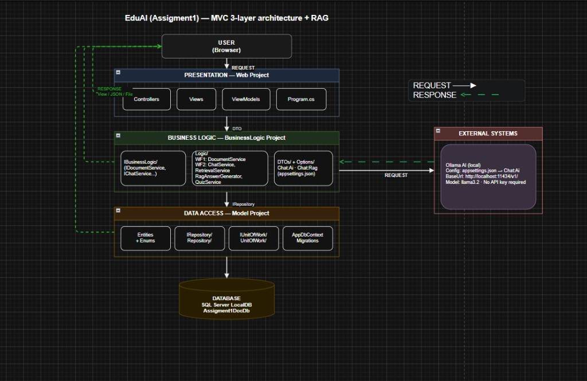

# EduAI (PRN222 - Final Project, cập nhật từ [Assignment 2](https://github.com/chanqua321/PRN222-Assigment2))

Nền tảng web hỗ trợ học tập thông minh: quản lý môn học/tài liệu theo chương, index tài liệu (chunk + embedding) và chatbot RAG hỏi đáp theo nội dung tài liệu.

- **Tech stack**: ASP.NET Core 8 (Razor Pages), EF Core 8, Identity (Cookie), SignalR, SQL Server (LocalDB), Gemini API, MailKit (SMTP).
- **Solution structure**:
  - `src/EduAI.Web`: Web UI + Hubs + Middleware + Seed
  - `src/EduAI.BusinessLogic`: Business services
  - `src/EduAI.Model`: Entities + DbContext + Migrations

## Kiến trúc tổng quan



## Yêu cầu môi trường

- .NET SDK **8.x**
- SQL Server **LocalDB** (hoặc SQL Server khác nếu bạn đổi connection string)
- (Tuỳ chọn) Visual Studio 2022 / JetBrains Rider

## Cấu hình

File cấu hình chính: `src/EduAI.Web/appsettings.json`

### 1) Database connection string

Ứng dụng đọc connection string:

- `ConnectionStrings:DefaultConnection`

Khi chạy lần đầu, app sẽ tự:

- **Migrate database** (`context.Database.MigrateAsync()`)
- **Seed roles + tài khoản demo** (`DataSeeder.SeedAsync(...)`)

### 2) Reset dữ liệu demo (tuỳ chọn)

Trong `appsettings.json`:

- `Database:ResetOnStartup = true`

Khi bật, app sẽ:

- Xoá database
- Chạy lại migrations
- Xoá thư mục upload (`AppSettings:UploadPath`)
- Seed lại dữ liệu demo

> Sau khi reset xong, nên đổi lại `Database:ResetOnStartup = false` để tránh bị xoá dữ liệu mỗi lần chạy.

### 3) Email (SMTP) + Gemini API (khuyến nghị không commit secrets)

Ứng dụng có các section:

- `EmailSettings` (SMTP)
- `Gemini` (API key + model)

**Khuyến nghị**: không commit password/API key vào git. Khi chạy local, bạn có thể dùng **User Secrets** hoặc **Environment Variables** để override.

Ví dụ User Secrets (PowerShell):

```powershell
cd src/EduAI.Web
dotnet user-secrets init
dotnet user-secrets set "EmailSettings:Password" "<your-smtp-app-password>"
dotnet user-secrets set "Gemini:ApiKey" "<your-gemini-api-key>"
```

## Chạy ứng dụng

### Chạy bằng dotnet CLI

```powershell
cd src/EduAI.Web
dotnet restore
dotnet run
```

Mặc định chạy ở:

- `https://localhost:7014`

> Trong môi trường Development, app có thể tự mở trình duyệt tới `AppSettings:AppBaseUrl`.

### Chạy bằng Visual Studio

- Mở solution `EduAI.slnx`
- Set startup project: `EduAI.Web`
- Run profile: `EduAI.Web` (HTTPS `7014`)

## Entity Framework (migrations)

Migrations nằm ở `src/EduAI.Model/Migrations`.

Update database (từ root workspace):

```powershell
dotnet ef database update --project src/EduAI.Model --startup-project src/EduAI.Web
```

Tạo migration mới (nếu cần):

```powershell
dotnet ef migrations add <MigrationName> --project src/EduAI.Model --startup-project src/EduAI.Web
```

## Tài khoản demo (seed)

Hệ thống seed sẵn 3 role: `Admin`, `Teacher`, `Student` và các tài khoản demo:

- **Admin**: `admin@gmail.com` / `12345`
- **Teacher**: `teacher@gmail.com` / `12345`
- **Student**: `student@gmail.com` / `12345`

## Tài liệu mô tả

Xem thêm đặc tả và kiến trúc:

- `docs/EduAI-Dac-Ta-Mon-Hoc.md`
- `docs/EduAI-Architecture.drawio`

